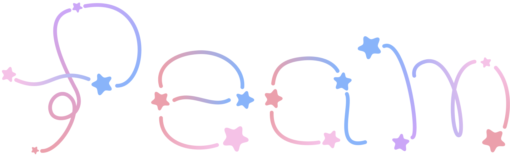

    

 

    

 

**Peam** (a combonation of "Peak" and "Beam") is a simple Roblox plugin to easily create beams via selecting attachments.

You can finally create n-length paths between attachments without having to painstakingly create each beam and joint by hand.

## Features

-   Create beams between attachments in a path
-   Easily create circular beams
-   Converge multiple beams into a single attachment
-   Use other beam objects as a reference for beam creation

## Issues & contributions

If you feel like theres an issue to report or help out with, feel free to open an issue or pull request!

## License

Peam is licensed under the MIT license. Go wild!
